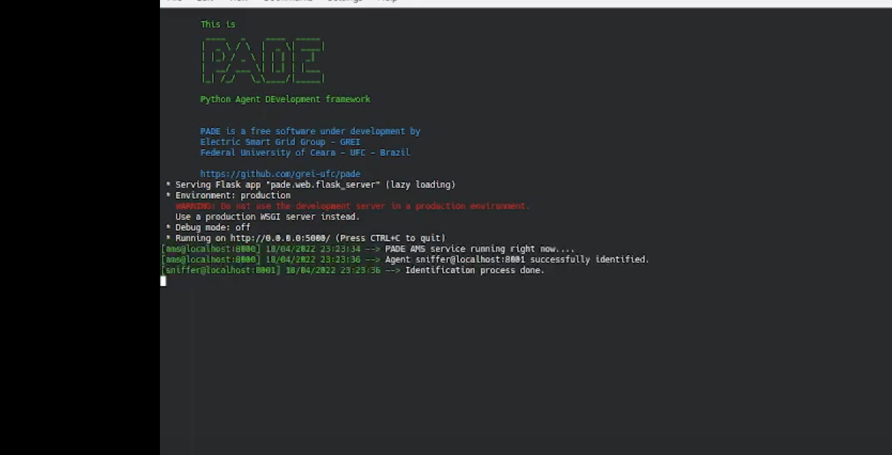
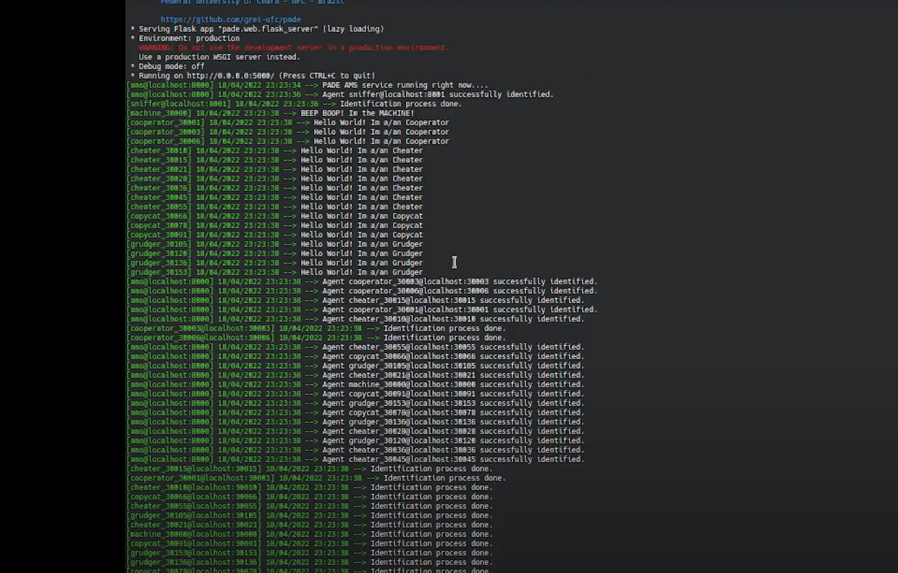
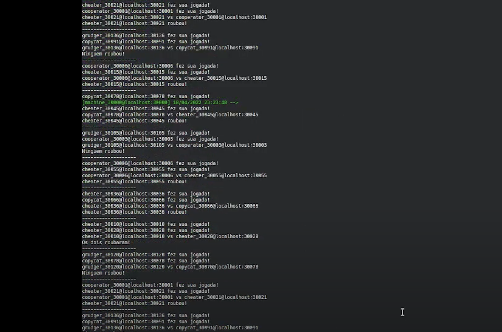

# 2021.2_G2_SMA_Trust_and_Game_Theory

Paradigmas:
 - SMA

# Trust_and_Game_Theory

**Disciplina**: FGA0210 - PARADIGMAS DE PROGRAMAÇÃO - TA <br>
**Nro do Grupo**: 02<br>
**Paradigma**: SMA<br>

## Alunos
|  Matrícula | Aluno          |
| ---------- | -------------- |
| 18/0014412 |  Cainã Freitas |
| 17/0141161 |  Erick Giffoni |
| 18/0016563 |  Filipe Machado |
| 18/0105345 |  Lucas Ferraz  |
| 16/0015006 |  Matheus O. Patrício |
| 17/0122468 |  Nilvan Peres |
| 18/0011308 |  Peniel Etèmana |
| 18/0078640 |  Yuri Alves |

## Sobre 
Durante uma guerra é natural que se tenha desconfiança em um nível elevado entre os envolvidos. Mas, por quê durante momentos de paz essa desconfiança continua sendo grande e em constante crescimento? O jogo tenta explicar justamente esse questionamento.

O jogo Trust and Game Theory, que em português seria Confiança e Teoria do Jogo, se baseia no fato da trégua de natal ocorrida no meio da primeira grande guerra mundial e tenta explicar o comportamento adotado pelos soldados e sua confiança. 

### Regras do jogo: 
- Há 2 opções - colocar a moeda (cooperate) ou não colocar a moeda na máquina (cheat);
- Se os 2 jogadores colocam a moeda os dois recebem de volta 2 moedas (cada um);
- Se os 2 jogadores não colocam a moeda, os dois recebem de volta 0 moeda;
- Se 1 jogador coopera e o outro trapaceia, quem cooperou perde 1 moeda, quem trapaceou recebe 3 moedas.

### Tipos de agentes: 

jogador e máquina.

Jogador: All cooperate, All cheat, Copycat e Grudger.
Os jogadores são agentes comportamentais, cuja ação é colocar uma moeda na máquina ou não colocar.

Máquina: a função da máquina é, para cada rodada, receber a ação dos dois jogadores, fazer a contagem de moedas que cada um irá receber (baseada nas regras do jogo), e enviar essas quantias aos respectivos jogadores.

### Torneio

Simularemos cenários em que diferentes jogadores se enfrentam, no formato de torneio. Para cada rodada, haverá um vencedor, ou empate. O jogador que, após uma rodada, ficar com zero ou menos de saldo em moedas será eliminado do torneio.

A rodada funciona assim: 2 jogadores se enfrentam. Eles vão optar por colocar a moeda ou não por Y vezes. Ao final, a máquina consulta o saldo de cada um e anuncia o vencedor ou empate.

## Screenshots

Inicialização



Configurando agentes...



Jogos acontecendo



## Instalação 
**Linguagens**: Python<br>
**Tecnologias**: [Pade](https://github.com/grei-ufc/pade), Docker, Docker-compose<br>
Descreva os pré-requisitos para rodar o seu projeto e os comandos necessários.
Insira um manual ou um script para auxiliar ainda mais.

Pré-requisitos:

- docker
- docker-compose

## Instalação

1. Faça o *clone* do projeto

```$ git clone https://github.com/UnBParadigmas2021-2/2021.2-G2_Solaire_Disciples_SMA_Trust_and_Game_Theory.git```

2. Inicialize o Docker no seu computador

3. Entre na pasta raiz do projeto

4. Execute o docker-compose

```$ docker-compose up```


## Uso

Caso o programa não inicie automaticamente junto ao docker-compose, comece pelo
passo 1 abaixo. Caso contrário vá para o passo 5.

1. Encontre o id do container docker do projeto

```$ docker ps```

Procure o CONTAINER ID da imagem 20212-g2_solaire_disciples_sma_trust_and_game_theory_pade


2. Execute a imagem docker

```$ docker exec -it <id do container> bash```


3. Entre na pasta `src`


4. Execute o código principal com o pade

```$ pade start-runtime --num <quantidade de processos> --port 20000 main.py <incremento da porta>```

5. O pade talvez peça o nome de usuário e senha. Pode simplesmente dar "enter".


## Vídeo

Assista aqui: https://youtu.be/kPjzj73cK4M

## Outros 
Quaisquer outras informações sobre seu projeto podem ser descritas a seguir.

## Fontes

THE EVOLUTION of Trust. [S. l.], 2017. Disponível em: https://ncase.me/trust/. Acesso em: 18 abr. 2022.

AGENT-EXAMPLE-5. [S. l.], 23 jan. 2020. Disponível em: https://github.com/grei-ufc/pade/blob/master/examples/agent_example_5.py. Acesso em: 18 abr. 2022.
